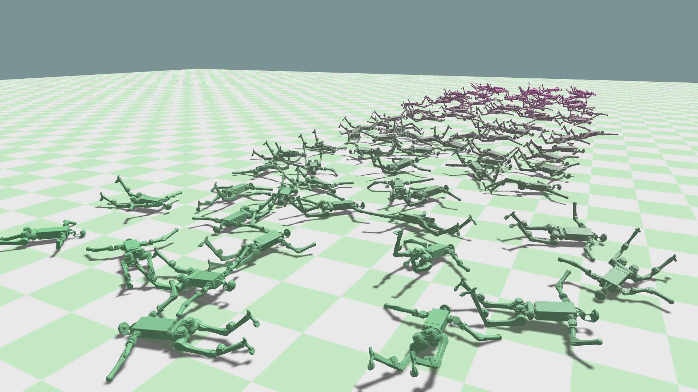
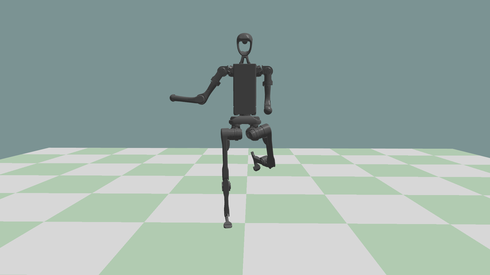
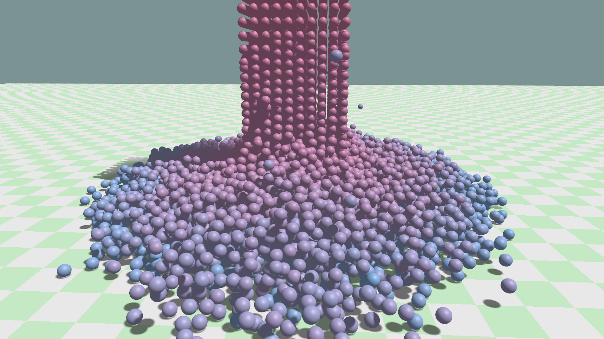
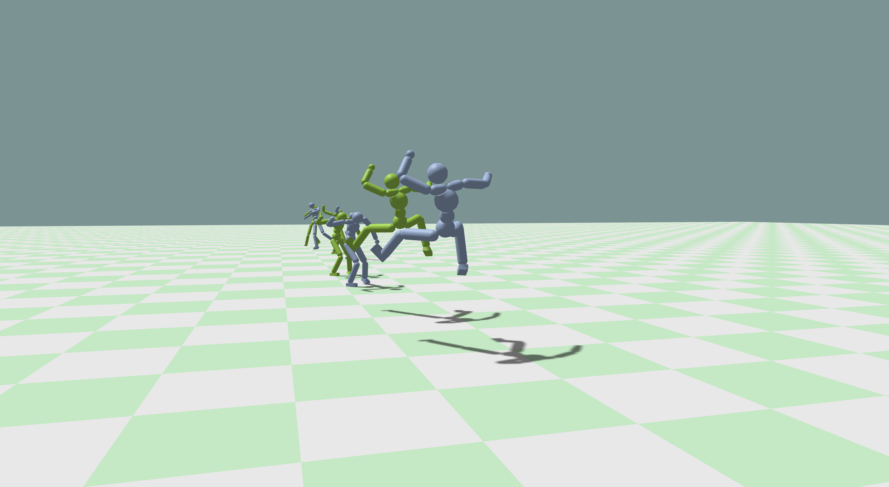
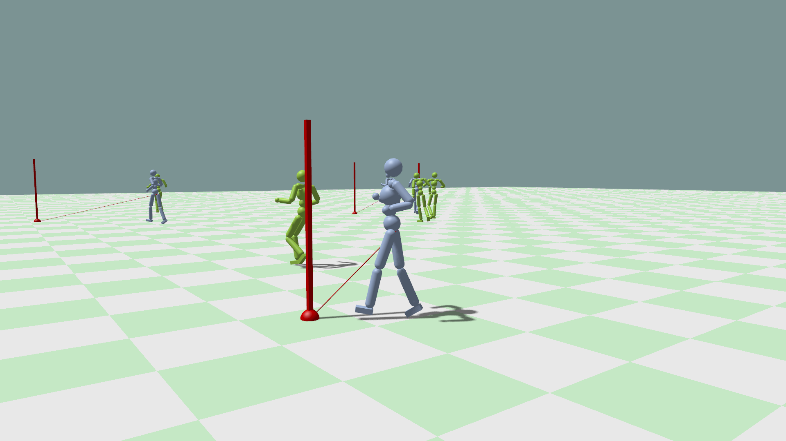

# KangEngine

A lightweight C++ engine for computer graphics and robotics research, with a Python interface for simulation and control experiments.

<table align="center">
  <tr>
    <td width="33%" align="center"></td>
    <td width="33%" align="center"></td>
    <td width="33%" align="center"></td>
  </tr>
</table>

## Features

### Rendering
- OpenGL renderer with instanced mesh drawing and a lightweight graphics abstraction layer (WebGPU planned)
- Scene-graph and handle-driven rendering paths for static scenes, physics objects, and large crowds
- Shadow mapping, skybox rendering, gamma post-processing, and ImGui tooling
- GPU skinning for animated FBX characters
- Debug rendering utilities for lines, arrows, coordinate axes, and camera frustums

### Asset Import
- FBX: skeletons, animation clips, static meshes, and skinned meshes
- MJCF: articulated characters, collision geometry, joints, and inertials
- USD: mesh traversal, material subsets, and diffuse texture loading
- OBJ/STL static mesh import

### Simulation & Animation
- PhysX rigid bodies and articulated robot simulation
- Skeleton trees, sampled motion clips, FK, and pose states
- Bridges for syncing physics, skeletons, and skinned characters to rendering
- Experimental XPBD cloth simulation(non-PhysX)

### Python
- pybind11 bindings for app, scene, animation, physics, and asset APIs
- Headless simulation and live visualization helpers
- MimicKit-compatible backend adapter

## How to build
Install CMake first, then follow the platform steps below.

<details>
<summary> vcpkg </summary>
KangEngine uses vcpkg manifest mode for most third-party C++ dependencies.

1. Clone and bootstrap vcpkg.
    ```bash
    git clone https://github.com/microsoft/vcpkg.git
    cd vcpkg && ./bootstrap-vcpkg.sh
    ```
2. Export `VCPKG_ROOT` and add vcpkg to `PATH`.
    ```bash
    export VCPKG_ROOT=/path/to/vcpkg
    export PATH=$VCPKG_ROOT:$PATH
    ```
</details>

<details>
<summary> Linux (tested with Ubuntu 24.04)</summary>

1. Install system packages.
    ```bash
    sudo apt install clang ninja-build unzip libxinerama-dev libxcursor-dev xorg-dev libglu1-mesa-dev pkg-config autoconf autoconf-archive automake libtool
    ```
2. Download NVIDIA Omniverse PhysX under `$HOME/Physics/PhysX`.
    ```bash
    mkdir -p ~/Physics
    cd ~/Physics
    wget https://github.com/NVIDIA-Omniverse/PhysX/archive/refs/tags/104.1-physx-5.1.2.zip
    unzip 104.1-physx-5.1.2.zip
    mv PhysX-104.1-physx-5.1.2 PhysX
    ```
3. Build PhysX with clang.
    ```bash
    cd ~/Physics/PhysX/physx
    ./buildtools/packman/packman update -y
    ./generate_projects.sh

    cd compiler/linux-release
    cmake . \
      -DCMAKE_C_COMPILER=clang \
      -DCMAKE_CXX_COMPILER=clang++ \
      -DCMAKE_CXX_FLAGS="-Wno-error=unsafe-buffer-usage -Wno-unsafe-buffer-usage -Wno-error=switch-default -Wno-switch-default -Wno-error=invalid-offsetof -Wno-invalid-offsetof -Wno-error=unused-but-set-variable -Wno-unused-but-set-variable"
    cmake --build . --config release # (debug|checked|profile|release)
    ```
    Do not run the PhysX configure/build commands with `sudo`. If files were created as root, fix ownership first.
    ```bash
    sudo chown -R "$USER:$USER" ~/Physics/PhysX/physx
    ```
    The PhysX snippet executables may fail to link against the bundled OpenGL package, but KangEngine only needs the PhysX static libraries in `~/Physics/PhysX/physx/bin/linux.clang/release`.
4. Configure KangEngine with clang.
    ```bash
    CC=clang CXX=clang++ cmake --preset=vcpkg
    ```
5. Build KangEngine.
    ```bash
    cmake --build build/release
    ```
6. Run KangEngine.
    ```bash
    make run2
    ```

</details>

<details>
<summary> macOS (tested with M4 mac)</summary>

1. Clone o3de PhysX under `$HOME/Physics/PhysX`.
    ```bash
    mkdir -p ~/Physics
    cd ~/Physics
    git clone -b 104.1 https://github.com/o3de/PhysX.git
    ```
2. Install build tools.
    ```bash
    brew install coreutils ninja autoconf automake autoconf-archive
    ```
3. Build PhysX.
    ```bash
    cd ~/Physics/PhysX/physx
    ./buildtools/packman/packman update -y
    ./generate_projects.sh

    # Note: The O3DE PhysX build system uses the 'mac.x86_64' directory name for all macOS builds, including M-chips.
    cd compiler/mac.x86_64
    cmake --build . --config release # (debug|checked|profile|release)
    ```
4. Configure KangEngine.
    ```bash
    cmake --preset=vcpkg
    ```
5. Build KangEngine.
    ```bash
    cmake --build build/release
    ```

</details>

<details>
<summary>OpenUSD (Optional)</summary>

OpenUSD is only needed when configuring KangEngine with `-DUSE_USD=ON`.

1. Clone OpenUSD.
    ```bash
    cd ~
    git clone https://github.com/PixarAnimationStudios/OpenUSD.git
    ```
2. Build OpenUSD into `~/usd_build`.
    ```bash
    mkdir -p ~/usd_build
    python3 ~/OpenUSD/build_scripts/build_usd.py ~/usd_build
    ```
3. If you build OpenUSD somewhere else, pass `-Dpxr_DIR=/path/to/usd_build` to your CMake configure command instead of modifying `CMakeLists.txt`.

</details>

<details>

<summary> Python Bindings (Optional) </summary>
KangEngine exposes a Python module (`kangengine`) via pybind11. The extension is built by CMake and must be compiled against the same Python that will run it.

1. Create a virtual environment with Python 3.12 using [uv](https://github.com/astral-sh/uv).
    ```bash
    cd python
    uv venv .venv --python 3.12
    source .venv/bin/activate
    ```
2. Build the extension with CMake from the repo root.
    ```bash
    cd ..
    make build_python
    # or with USD support:
    # make build_usd_python
    ```
3. Install the Python package in editable mode.
    ```bash
    cd python
    uv pip install -e .
    ```
4. Run an example.
    ```bash
    python examples/control_demo.py
    ```
</details>

## RL with MimicKit

KangEngine can be used as a backend engine of [MimicKit](https://github.com/xbpeng/MimicKit) through KangEngine's Python
package. Use the `backend_kangengine` branch of MimicKit and keep MimicKit in a
separate Python environment.

<table align="center">
  <tr>
    <td width="50%" align="center"></td>
    <td width="50%" align="center"></td>
  </tr>
</table>

1. Clone the KangEngine-enabled MimicKit fork branch.
    ```bash
    git clone -b backend_kangengine https://github.com/Gudegi/MimicKit.git
    ```
2. Create and activate a MimicKit Python environment with uv.
    ```bash
    cd MimicKit
    uv venv .venv --python 3.12
    source .venv/bin/activate
    ```
3. Build KangEngine's Python extension from the KangEngine repo.
    ```bash
    cd /path/to/KangEngine
    make build_python
    ```
4. Install KangEngine's Python package into the MimicKit environment.
    ```bash
    cd python
    uv pip install -e .
    ```
5. Install MimicKit dependencies.
    ```bash
    cd /path/to/MimicKit
    source .venv/bin/activate
    uv pip install -r requirements.txt
    ```
6. Run a small motion visualize test.
    ```bash
    python mimickit/run.py \
      --mode test \
      --num_envs 1 \
      --engine_config data/engines/kangengine_engine.yaml \
      --env_config data/envs/view_motion_humanoid_env.yaml \
      --visualize true \
      --devices cpu \
      --test_episodes 10
    ```
7. Run pretrained policy inference with KangEngine.
    ```bash
    python mimickit/run.py \
      --mode test \
      --num_envs 4 \
      --engine_config data/engines/kangengine_engine.yaml \
      --env_config data/envs/amp_humanoid_env.yaml \
      --agent_config data/agents/amp_humanoid_agent.yaml \
      --visualize true \
      --model_file data/models/amp_humanoid_spinkick_model.pt
    ```
    Currently, KangEngine has only been tested with pretrained MimicKit policy
    inference, not full RL training.

For reference, the MimicKit KangEngine backend uses an engine config like this:

```yaml
engine_name: "kangengine"

control_mode: "pos"
control_freq: 30
sim_freq: 120
env_spacing: 5
enable_self_collisions: false
```

The `backend_kangengine` branch already includes
`data/engines/kangengine_engine.yaml`, so you usually do not need to create it
manually.
