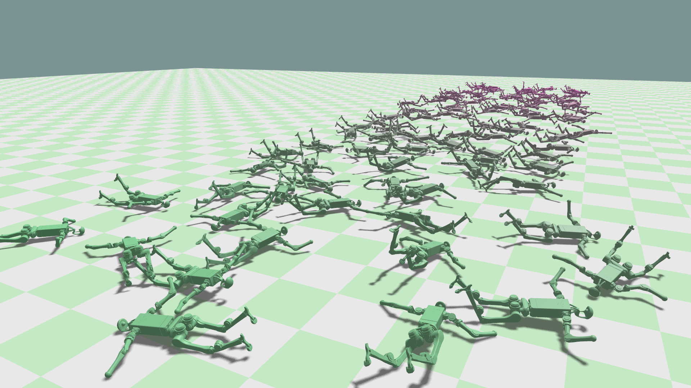
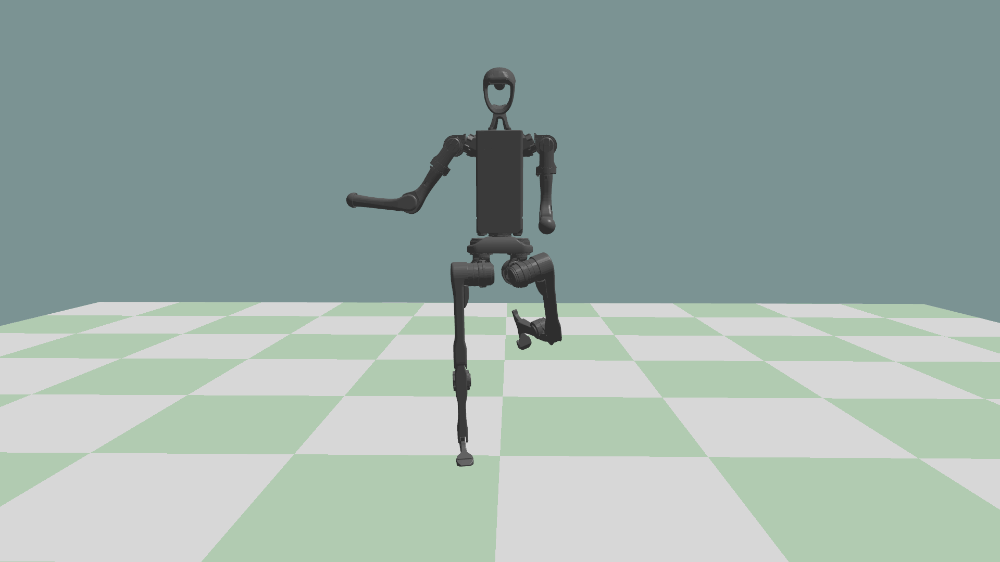
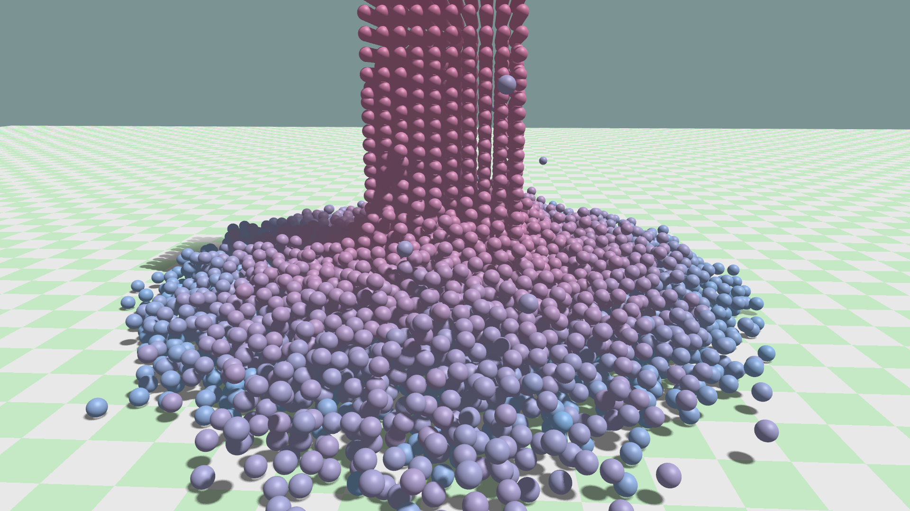
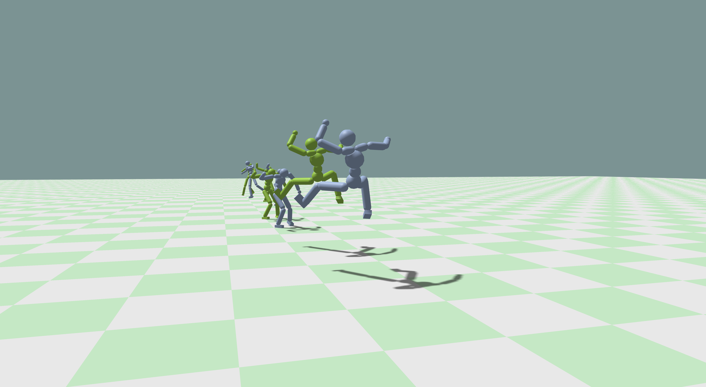
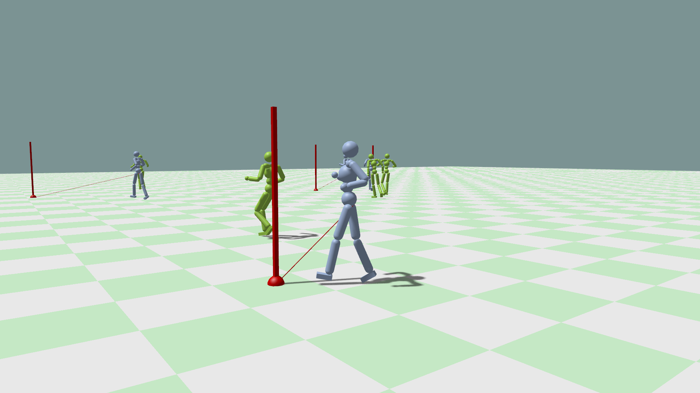

# KangEngine

A lightweight C++/Python engine for visualizing motion, robotics assets, and PhysX-based simulation experiments.

> **Note:** This is a personal, long-term codebase dedicated to ongoing research and self-study. It is crafted as a lifetime sandbox for exploring computer graphics (especially character animation) and robotics control.


<table align="center">
  <tr>
    <td width="33%" align="center"></td>
    <td width="33%" align="center"></td>
    <td width="33%" align="center"></td>
  </tr>
</table>

KangEngine is built for quick iteration around character motion, robot assets, and simulation visualization. The C++ side owns the renderer, scene graph, asset loaders, and PhysX integration; the Python package exposes the same runtime for scripts, motion tools, control experiments, and MimicKit integration.

## Requirements

- **OS:** macOS on Apple Silicon (Tahoe tested) or Linux (Ubuntu 24.04 tested)
- **Build:** C++17, CMake, vcpkg, PhysX 5.1/5.8
- **Python:** 3.12 for bindings and examples
- **Graphics & GPU:** OpenGL 4.1+ compatible GPU (NVIDIA GPU required only for experimental PhysX GPU/CUDA workflows)

## What It Does

- **Multi-Format Asset Viewer:** Loads FBX, BVH, MJCF, OpenUSD, OBJ, and STL assets.
- **Motion Inspection:** Visualizes skeletal motion, FK poses, root trajectories, contacts, and tracking targets.
- **Interactive Visualization:** Provides skinned character rendering, skeleton overlays, debug drawing, and scene interaction tools.
- **PhysX Simulation:** Runs rigid bodies, articulated robots, and motion-tracking control experiments.
- **Python Workflows:** Provides Python APIs for motion editing, IK/control experiments, simulation scripts, and MimicKit integration.

## Quick Start

Build the C++ executable:

```bash
cmake --preset=vcpkg
cmake --build build/release
make run2
```

Build and install the Python package:

```bash
cd python
uv venv .venv --python 3.12
source .venv/bin/activate
cd ..
make build_python
cd python
uv pip install -e .
```

Run a Python motion viewer:

```bash
python examples/view_bvh_character.py
```

Run a Python PhysX example:

```bash
python examples/sim_world_minimal.py
```

See [Build Guide](docs/BUILD.md) for platform setup, PhysX, USD, and Python binding details.

## Example Catalog

| Area | Example | What it shows |
|---|---|---|
| Motion | `python/examples/view_bvh_character.py` | BVH loading, skeleton visualization, motion sequencer |
| Motion | `python/examples/view_fbx_character2.py` | FBX character viewing with motion editor modules |
| Assets | `python/examples/view_fbx_mesh.py` | FBX static mesh import and scene manipulation |
| Assets | `python/examples/view_usd_scene.py` | USD scene traversal and material loading |
| Physics | `python/examples/sim_world_minimal.py` | Minimal `KangSimWorld` simulation and viewer sync |
| Physics | `python/examples/sim_world_multi_env.py` | Batched multi-env simulation with tensor state reads |
| Physics | `python/examples/sim_gpu_root_state_batch.py` | Headless PhysX GPU batched rigid root-state apply/readback |
| Physics | `python/examples/physx_ragdoll.py` | Free-base articulated ragdoll simulation |
| Physics | `python/examples/mjcf_dof_control.py` | MJCF loading and DOF control |
| Tracking | `python/examples/physx_h1_motion_tracking.py` | H1 PhysX articulation tracking a reference motion |
| Physics | `examples/physics/physx_h1_instancing.cpp` | High-throughput ExternalBuffer visual sync |
| Physics | `examples/physics/xpbd_cloth.cpp` | XPBD cloth simulation test |
| Debug | `examples/debug_camera_frustum.cpp` | Camera frustum and renderer AABB debug tools |

See [Examples](docs/EXAMPLES.md) for a longer list.

## Feature Overview

### Rendering

- OpenGL renderer with instanced mesh drawing and a lightweight graphics abstraction layer.
- SceneGraph and ExternalBuffer transform paths for authored scenes and high-throughput simulation visuals. See `examples/physics/physx_h1_instancing.cpp`.
- Shadow mapping, skybox rendering, gamma post-processing, ImGui tooling, and post-process selection outlines.
- GPU skinning for animated FBX characters.
- Debug rendering utilities for lines, arrows, coordinate axes, points, and camera frustums.

### Asset Import

- FBX: skeletons, animation clips, static meshes, and skinned meshes.
- BVH: skeleton hierarchy, frame time, root motion, and local joint rotations.
- MJCF: articulated characters, collision geometry, joints, and inertials.
- USD: mesh traversal, material subsets, and diffuse texture loading.
- OBJ/STL static mesh import.

### Simulation & Animation

- PhysX rigid bodies and articulated robot simulation.
- Skeleton trees, sampled motion clips, FK, pose states, and skeleton visual bridges.
- Bridges for syncing physics, skeletons, and skinned characters to scene/render state.
- Experimental XPBD cloth simulation. See `examples/physics/xpbd_cloth.cpp`.

### Advanced Runtime Paths

- **ExternalBuffer visual sync:** skips per-object scene graph mutation during simulation and uploads batched transforms directly to renderer-owned instance buffers. This is the preferred path for large simulation visuals such as many robot bodies or rigid objects.
- **XPBD cloth:** a non-PhysX cloth simulation experiment used to explore constraint-based deformable simulation.

### Python

- pybind11 bindings for app, scene, animation, physics, asset, and renderer-facing APIs.
- Headless simulation and live visualization helpers.
- Motion editor modules for trajectories, contacts, targets, and tracking overlays.
- MimicKit-compatible backend adapter.

See [Simulation API](docs/SIMULATION_API.md) for the recommended `KangSimWorld` workflow and how it relates to lower-level PhysX wrappers.

## Development Notes

This project is evolving quickly. While the main workflows are stable, some internal and high-level APIs are under active development and subject to change.

TODO:

- WebGPU backend.
- MJCF sensor grouping and full contact-wrench semantics.
- PBR rendering.

## RL With MimicKit

KangEngine can be used as a backend engine of [MimicKit](https://github.com/xbpeng/MimicKit) through KangEngine's Python package. Use the `backend_kangengine` branch of MimicKit and keep MimicKit in a separate Python environment.

**Limitation**: KangEngine supports both MimicKit policy inference and RL training, but the most stable workflows still use the CPU PhysX path. Linux PhysX 5.8 rigid/articulation state and apply paths, CUDA/OpenGL visual sync, and normal contact impulse/force sensors are validated. Tangential friction and full contact-wrench sensors are not yet exposed.

<table align="center">
  <tr>
    <td width="50%" align="center"></td>
    <td width="50%" align="center"></td>
  </tr>
</table>

<details>
<summary>MimicKit setup and run commands</summary>

1. Clone the KangEngine-enabled MimicKit fork branch.

    ```bash
    git clone -b backend_kangengine https://github.com/Gudegi/MimicKit.git
    ```

2. Create and activate a MimicKit Python environment with uv.

    ```bash
    cd MimicKit
    uv venv .venv --python 3.12
    source .venv/bin/activate
    ```

3. Build KangEngine's Python extension from the KangEngine repo.

    ```bash
    cd /path/to/KangEngine
    make build_python
    ```

4. Install KangEngine's Python package into the MimicKit environment.

    ```bash
    cd python
    uv pip install -e .
    ```

5. Install MimicKit dependencies.

    ```bash
    cd /path/to/MimicKit
    uv pip install -r requirements.txt
    ```

6. Run a small motion visualization test.

    ```bash
    python mimickit/run.py \
      --mode test \
      --num_envs 1 \
      --engine_config data/engines/kangengine_engine.yaml \
      --env_config data/envs/view_motion_humanoid_env.yaml \
      --visualize true \
      --devices cpu \
      --test_episodes 10
    ```

7. Run pretrained policy inference with KangEngine.

    ```bash
    python mimickit/run.py \
      --mode test \
      --num_envs 4 \
      --engine_config data/engines/kangengine_engine.yaml \
      --env_config data/envs/amp_humanoid_env.yaml \
      --agent_config data/agents/amp_humanoid_agent.yaml \
      --visualize true \
      --model_file data/models/amp_humanoid_spinkick_model.pt
    ```

For reference, the MimicKit KangEngine backend uses an engine config like this:

```yaml
engine_name: "kangengine"

control_mode: "pos"
control_freq: 30
sim_freq: 120
env_spacing: 5
enable_self_collisions: false
```

The `backend_kangengine` branch already includes `data/engines/kangengine_engine.yaml`, so you usually do not need to create it manually.

</details>

## References

KangEngine is inspired by and built upon ideas from these excellent projects:

**Frameworks & Learning Workflows**
- [MimicKit](https://github.com/xbpeng/MimicKit): Motion imitation and RL experiment structure.
- [Isaac Lab](https://github.com/isaac-sim/IsaacLab): Robot learning workflows and simulation tooling.
- [Newton](https://github.com/newton-physics/newton): Robotics API shape and GPU simulation design.

**Animation & Motion Editing**
- [GenoViewPython](https://github.com/orangeduck/GenoViewPython): Skeletal animation and motion-debug visualization.
- [AI4AnimationPy](https://github.com/facebookresearch/ai4animationpy): Motion modules and animation-engine structure.

**Core Backends**
- [NVIDIA PhysX](https://github.com/NVIDIA-Omniverse/PhysX): Rigid body and articulation simulation.
- [OpenUSD](https://github.com/PixarAnimationStudios/OpenUSD): Scene description and asset loading.
