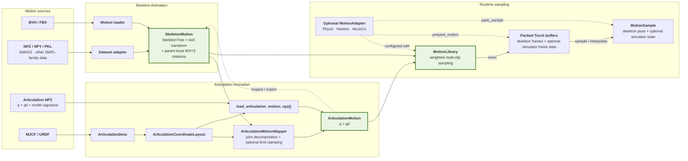

# Articulation Motion

- `SkeletonMotion` stores character poses as a world-space root translation, a world-space root rotation, and parent-local joint rotations, with all rotations represented as WXYZ quaternions.
- `ArticulationMotion` stores a sampled articulation trajectory as frame-major generalized configurations `q` and generalized tangent velocities `qd`, arranged according to an `ArticulationCoordinateLayout`.

Use this conversion when preparing animation data for robot control, motion
tracking, or simulation datasets.

## Motion data flow

KangEngine normalizes animation files and dataset-specific arrays into
`SkeletonMotion`. An articulation layout can then map the same motion into
`ArticulationMotion`. `MotionLibrary` accepts `SkeletonMotion` and articulation
motions that can be converted back to that representation, then provides packed
sampling and optional backend-native state generation.



## Convert a motion

Build the layout from the same `ArticulationDesc` used by the simulator. The
layout preserves the loader's BFS or DFS body order.

```python
import kangengine as ke

data = ke.asset.MJCFLoader.load(mjcf_path, order="DFS")
layout = ke.animation.ArticulationCoordinateLayout.from_data(
    data=data,
    free_root=True,
)
mapper = ke.animation.ArticulationMotionMapper(layout)

result = mapper.to_articulation_motion(skeleton_motion)
articulation_motion = result.motion

q = articulation_motion.q    # [frames, layout.nq], float32 NumPy view
qd = articulation_motion.qd  # [frames, layout.nv], float32 NumPy view
```

`residual_angles` reports, in radians, rotation that joint decomposition could
not represent. When `clamp_to_limits=True`, the residual also includes error
introduced by limit clamping. Use it to detect unsuitable mappings or motions
outside the robot's range.

## Coordinate layout

Each `layout.blocks` entry describes one joint coordinate block and its offsets
inside `q` and `qd`.

| Joint type | `q` value | `q` dimension | `qd` value | `qd` dimension |
|---|---|---:|---|---:|
| Fixed | none | 0 | none | 0 |
| Revolute | angle | 1 | angular velocity | 1 |
| Prismatic | position | 1 | linear velocity | 1 |
| Spherical(Ball) | quaternion `(w, x, y, z)` | 4 | angular velocity `(x, y, z)` | 3 |
| Free root | position `(x, y, z)` + quaternion `(w, x, y, z)` | 7 | linear velocity `(x, y, z)` + angular velocity `(x, y, z)` | 6 |

Therefore `layout.nq` and `layout.nv` may differ. Quaternion orientations use
four configuration values but have only three tangent velocity coordinates.

The layout also contains a `model_signature`. Mappers and backend adapters
require matching signatures. `load_articulation_motion_npz()` instead requires
matching `nq` and `nv`; it warns but still loads when only the signature differs.
This permits compatible extensions, but the warning may indicate a different
body order, joint layout, reference pose, or limits.

## Convert back for inspection

Convert the complete clip back to `SkeletonMotion` for visualization or BVH
export:

```python
preview_motion = mapper.to_skeleton_motion(articulation_motion)
```

Single poses can be converted in either direction:

```python
mapped = mapper.to_articulation_coordinates(skeleton_state)
restored_state = mapper.to_skeleton_state(mapped.q)
```

`SkeletonState` and `SkeletonMotion` cannot represent prismatic joints. An
`ArticulationMotion` containing prismatic joints therefore cannot be converted
back to either representation.

## Reference motion library

`MotionLibrary` stores the backend-independent quaternion form: root position,
root rotation, and local joint rotations. It accepts either `SkeletonMotion`
or `ArticulationMotion`; the latter is converted to `SkeletonMotion` for
canonical storage when registered. Consequently, articulation motion containing
prismatic joints cannot be registered.

```python
adapter = ke.adapters.physx.PhysXMotionAdapter(layout)
library = ke.animation.MotionLibrary(
    motions=[walk_motion, run_motion],
    adapter=adapter,
    device="cuda:0",
    precompute_kinematics=True,
)

sample = library.sample(
    motion_ids=[0, 1],
    times=[0.25, 0.75],
    loop=True,
)

local_rotation = sample.local_rotations_wxyz
body_state = library.sample_kinematics(sample)
body_position = body_state.body_positions
body_rotation = body_state.body_rotations_wxyz
physx_joint_position = sample.backend_state.joint_positions
physx_joint_velocity = sample.backend_state.joint_velocities

# If using MuJoCoMotionAdapter:
# mujoco_qpos = sample.backend_state.qpos
# mujoco_qvel = sample.backend_state.qvel

# If using NewtonMotionAdapter:
# newton_joint_q = sample.backend_state.joint_q
# newton_joint_qd = sample.backend_state.joint_qd

buffers = library.packed_buffers()
global_position_frames = buffers.global_positions
```

The library uploads all clips and metadata to packed Torch buffers. It uses
linear root-position interpolation and quaternion SLERP, then asks the optional
adapter to produce simulator-native tensors on the same device. Use
`forward_kinematics(sample)` when occasional samples need robot-body positions
or rotations. For high-frequency imitation and GPU kernels, construct the
library with `precompute_kinematics=True` and obtain persistent frame-major
position, rotation, linear-velocity, and angular-velocity tensors through
`packed_buffers()`. These borrowed tensors can be shared with runtimes such as
Warp without a copy; acquire the view again after adding clips or calling
`library.to(device)`. Source `SkeletonMotion` objects are not retained by default;
pass `keep_source_motions=True` only when `library.motion(id)` is needed for
inspection, editing, or export. The optional adapter also receives the original
input during registration. Newton and MuJoCo adapters can reuse an
`ArticulationMotion` input's existing `q/qd`; the PhysX adapter derives its
logical DOFs from the converted skeleton rotations. Use
`sample_motion_ids(...)` for weighted clip IDs, `sample_times(...)` for random
times, and `sample_frames(...)` for exact stored frames. `library.to(device)`
moves the packed library without rebuilding clips.

## Backend buffers

Backend adapters require only the canonical layout. The backend model or live
articulation can be checked explicitly before simulation, but it is not part of
reference motion storage or sampling.

### MuJoCo

```python
from kangengine.adapters.mujoco import MuJoCoMotionAdapter

adapter = MuJoCoMotionAdapter(layout)
adapter.validate_model(mj_model)  # optional compatibility check
buffers = adapter.pack(articulation_motion)
# buffers.qpos: [frames, layout.nq]
# buffers.qvel: [frames, layout.nv]

restored = adapter.unpack(
    buffers.qpos,
    buffers.qvel,
    fps=articulation_motion.fps(),
)
```

MuJoCo and canonical quaternions are both WXYZ. The adapter additionally
converts canonical free/ball angular velocities into MuJoCo's local tangent
frame.

### Newton

```python
from kangengine.adapters.newton import NewtonMotionAdapter

adapter = NewtonMotionAdapter(layout)
adapter.validate_model(newton_model)  # optional compatibility check
buffers = adapter.pack(articulation_motion)
# buffers.joint_q:  [frames, layout.nq]
# buffers.joint_qd: [frames, layout.nv]
```

The adapter handles Newton's XYZW quaternion storage. Optional validation also
checks grouped D6 offsets and authored axis order. The result remains one
reference trajectory; broadcasting it across worlds or selecting a different
frame per world belongs to the simulation or training layer.

### PhysX

```python
from kangengine.adapters.physx import PhysXMotionAdapter

adapter = PhysXMotionAdapter(layout)
adapter.validate_articulation(articulation)  # optional compatibility check
buffers = adapter.pack(articulation_motion)
# buffers.root_positions / root_rotations_xyzw
# buffers.root_linear_velocities / root_angular_velocities
# buffers.joint_positions / joint_velocities
```

PhysX root state is separate from logical joint state. Authored scalar
revolute/prismatic DOFs use the stable canonical order. Native
spherical blocks currently raise `NotImplementedError` instead of silently
discarding rotation, because KangEngine's PhysX wrapper does not yet expose a
complete three-axis spherical state.
