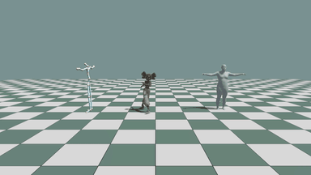

# Animation

KangEngine loads BVH and FBX motion, evaluates skeleton poses, displays
skeletons or skinned characters, and provides a Python motion editor.

- [Pose Visualization](VISUALS.md)

## Load motion

All motion loaders return the same `ke.animation.SkeletonMotion` type. This
lets playback, sampling, analysis, visualization, and BVH export operate on a
motion without depending on its source file format.

```python
from pathlib import Path

import kangengine as ke

# BVH hierarchy and animation
bvh_motion: ke.animation.SkeletonMotion = (
    ke.asset.BVHLoader.load_motion(bvh_path="walk.bvh", scale=1.0)
)

# One animation clip from an FBX character
fbx_motion: ke.animation.SkeletonMotion = ke.asset.FBXLoader.load_motion(
    fbx_path="character.fbx",
    clip_index=0,
    fps=60.0,
    scale=0.01,
)

# AMASS poses mapped onto a selected body-model skeleton
model_path: Path = ke.asset.smpl.repository_smplx_model_path(gender="neutral")
smplx_model: ke.asset.SMPLXModel = ke.asset.SMPLXModel.load(path=model_path)
smplx_body: ke.asset.SMPLXBody = smplx_model.create_body()
amass_motion: ke.animation.SkeletonMotion = ke.asset.AMASSLoader.load_motion(
    path="walking_poses.npz",
    skeleton_tree=smplx_body.skeleton_tree,
)
```

Use `load_skeleton()` when only the hierarchy is needed. Use `parse()` when
import diagnostics or source metadata are also needed:

```python
result: ke.asset.BVHImportResult = ke.asset.BVHLoader.parse(
    bvh_path="walk.bvh"
)
print(result.motion.num_frames(), result.frame_rate)
for warning in result.diagnostics.warnings:
    print(warning)
```

## View BVH motion

```python
motion: ke.animation.SkeletonMotion = ke.asset.BVHLoader.load_motion(
    bvh_path=bvh_file,
    scale=scale,
)
editor: ke.motion_module.MotionEditor = ke.motion_module.MotionEditor(
    motion=motion,
    motion_name=motion.motion_name(),
)

config: ke.visual.SkeletalVisualConfig = ke.visual.SkeletalVisualConfig()
skeleton: ke.visual.SkeletalVisual = ke.visual.SkeletalVisual.define(
    app=app,
    material=material,
    path="/bvh_skeleton",
    motion=motion,
    time=0.0,
    loop=True,
    config=config,
)
```

Update playback in the application loop:

```python
if editor.update(dt=app.get_delta_time()):
    skeleton.apply_motion(
        motion=motion,
        time=editor.player.time,
        loop=editor.player.loop,
    )
```

Run:

```bash
python ./python/examples/view_bvh_character.py /path/to/motion.bvh
```

<details>
<summary>Complete source: <code>view_bvh_character.py</code></summary>

```{literalinclude} ../../../../python/examples/view_bvh_character.py
:language: python
:linenos:
```

</details>


## Play multiple motion formats together

`view_motion_party.py` loads BVH, FBX, and AMASS/SMPL-X motion into the same
scene. Each source becomes the common `SkeletonMotion` type, while its visual
uses the appropriate skeleton or skinned-surface representation. The motion
sequencer displays a separate duration bar for each clip and drives all three
from one playback time.

```bash
python ./python/examples/view_motion_party.py \
  --bvh-file /path/to/motion.bvh \
  --fbx-file /path/to/character.fbx \
  --smpl-motion /path/to/amass_motion.npz
```

The SMPL-X neutral model is resolved from KangEngine's repository model
location. Use the command-line path options when the example assets or AMASS
dataset are stored elsewhere.

<details>
<summary>Complete source: <code>view_motion_party.py</code></summary>

```{literalinclude} ../../../../python/examples/view_motion_party.py
:language: python
:linenos:
```

</details>



Other examples:

- `python/examples/view_fbx_character.py`
- `python/examples/view_fbx_character2.py`
- `python/examples/view_fbx_character_apply_pose.py`
- `python/examples/view_smpl_motion.py`
- `python/examples/view_motion.py`

