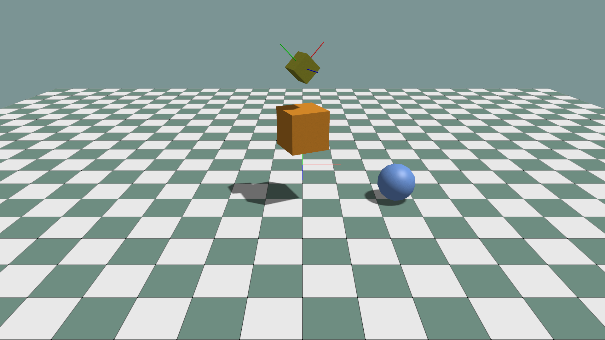

# First Scene

This example creates geometry data, inserts it into the scene, and demonstrates
materials, hierarchy, local/world transforms, quaternion input, and debug axes.

```python
import numpy as np


class MyApp(ke.App):
    def setup(self):
        self.standard_materials = self.create_standard_materials()
        self.scene.add_ground("/ground", scale=30.0)

        box = self.scene.add_mesh(
            "/box",
            ke.geometry.create_cube_data(1.0),
            self.standard_materials.common,
            color=ke.vec4(0.8, 0.3, 0.02, 1.0),
        )
        box.set_local_translation(ke.vec3(0.0, 2.0, 0.0))
        box.set_local_rotation_axis_angle(
            ke.vec3(0.0, 1.0, 0.0), np.deg2rad(25.0)
        )
```

The important separation is:

- `ke.geometry.create_cube_data(...)` creates mesh data only.
- `app.scene.add_mesh(...)` creates a scene prim and renderable view.
- The returned `box` view controls common rendering and transform operations.
- `box.prim` remains available for lower-level scene graph operations.

## Parent and child transforms

An absolute prim path establishes hierarchy. `/box/box2` is a child of
`/box`, so its local transform is relative to the first box.

```python
box2 = self.scene.add_mesh(
    "/box/box2",
    ke.geometry.create_cube_data(1.0),
    self.standard_materials.common,
)
box2.set_local_translation(ke.vec3(0.0, 1.5, 0.0))
box2.set_local_scale(ke.vec3(0.5, 0.5, 0.5))

local_position = box2.get_local_translation()
world_position = box2.get_world_translation()
```

Use `set_world_translation(...)` when a value is already expressed in scene
coordinates. Otherwise, prefer local transforms so children follow their
parent naturally.

## Quaternion ordering

`ke.quat` and NumPy inputs to quaternion object APIs use `wxyz` ordering.

```python
# Approximately 45 degrees around Z, in wxyz order.
box2.set_local_rotation(
    np.array([0.924, 0.0, 0.0, 0.383], dtype=np.float32)
)

rotation = box2.get_world_rotation()
rotation_wxyz = rotation.to_wxyz()
rotation_xyzw = rotation.to_xyzw()
```

Physics and simulation state arrays named `rot_xyzw` retain `xyzw` ordering.
Use `ke.quat.from_xyzw(...)` when moving such a value into a scene quaternion
API.

## Inspect transform axes

For a lightweight render overlay that does not create a scene prim:

```python
self.debug_overlay.axes(
    "/debug/world_axes",
    origin=np.array([0.0, 1.0, 0.0]),
    rotation=np.eye(3),
    length=1.0,
)
```

To create axes that appear in the SceneGraph, use the scene-backed helper:

```python
self.scene.debug_geometry.add_axes(
    "/debug/box2_axes",
    box2.get_world_translation(),
    box2.get_world_rotation(),
    length=0.8,
    radius=0.01,
)
```

`debug_overlay` draws directly through the graphics debug renderer and does not
create scene prims. `scene.debug_geometry` creates mesh-based renderables that
appear in the SceneGraph and returns a `DebugPrimitiveView`.

Run the complete example:

```bash
python ./python/examples/render_prim_scene.py
```

<details>
<summary>Complete source: <code>render_prim_scene.py</code></summary>

```{literalinclude} ../../../../python/examples/render_prim_scene.py
:language: python
:linenos:
```

</details>



Next: [First Simulation](FIRST_SIMULATION.md) or
[Scene and Rendering](../scene_rendering/INDEX.md).
