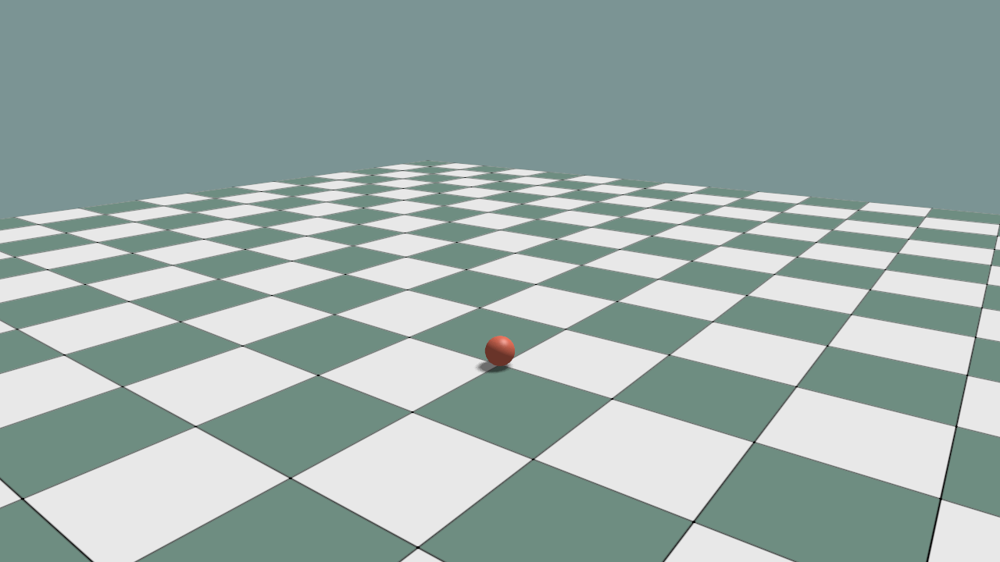

# First Simulation

This page creates one dynamic rigid body, steps PhysX, and synchronizes its
visual representation.

```python
self.standard_materials = self.create_standard_materials()
self.timing = self.configure_timing(
    ke.SimulationTimingConfig(
        render_hz=60.0,
        physics_hz=120.0,
        fixed_update_hz=60.0,
    )
)
self.set_simulation_hotkeys_enabled(enabled=True)
self.world: ke.sim.KangSimWorld = ke.sim.KangSimWorld(
    num_envs=1,
    sim_dt=self.timing.physics_dt,
    add_ground=True,
)
self.visual: ke.visual.sim.SimWorldVisualizer = ke.visual.sim.SimWorldVisualizer(
    app=self,
    world=self.world,
)

ball_xml = package_asset_path("objects", "ball.xml")
ball_data: ke.asset.ArticulationDesc = self.world.load_mjcf(
    mjcf_path=ball_xml,
)
self.ball: ke.sim.SimRigid = self.world.add_rigid(
    data=ball_data,
    env_id=0,
    obj_id=0,
    name="ball",
    pos=[0.0, 0.0, 1.8],
    density=600.0,
)
self.visual.add(
    sim_handle=self.ball,
    mjcf_path=ball_xml,
    material=self.standard_materials.common,
)
```

Advance at the fixed simulation rate and display the latest state once per
rendered frame:

```python
def fixed_update(self, fixed_dt):
    self.world.advance(fixed_dt)

def pre_render(self):
    self.visual.sync()
```

Run the complete example:

```bash
python ./python/examples/sim_world_minimal.py --width 1280 --height 720
```

<details>
<summary>Complete source: <code>sim_world_minimal.py</code></summary>

```{literalinclude} ../../../../python/examples/sim_world_minimal.py
:language: python
:linenos:
```

</details>

Expected result: the ball falls onto the ground. Enter toggles play/pause,
Space pauses or advances one step, and `R` resets it.



Next: [Fixed Timestep and Rendering](../simulation/FIXED_TIMESTEP.md) or
[Simulation](../simulation/INDEX.md).
