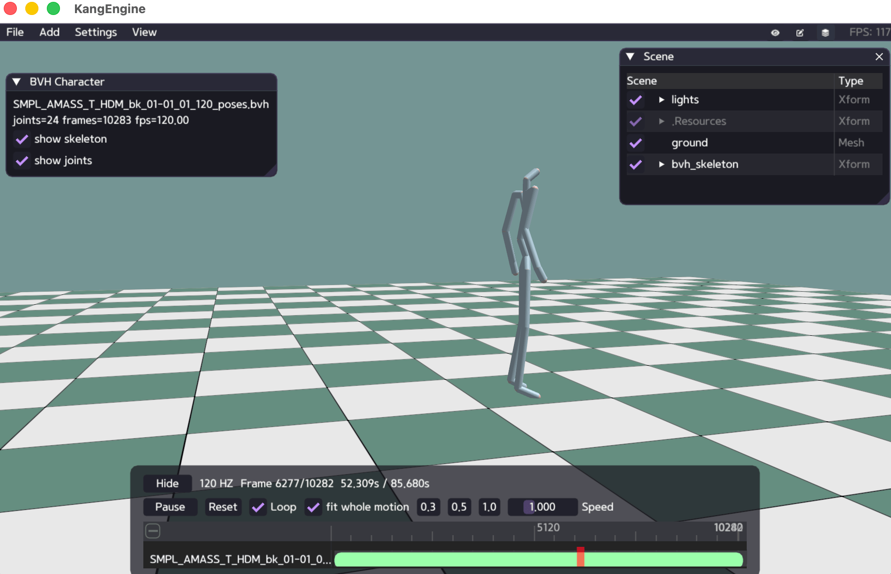

# Motion and Animation

KangEngine loads BVH and FBX motion, evaluates skeleton poses, displays
skeletons or skinned characters, and provides a Python motion editor.

## View BVH motion

```python
motion = ke.asset.BVHLoader.load_motion(bvh_file, scale)
editor = ke.motion_module.MotionEditor(motion, motion_name=motion.motion_name())

config = ke.visual.SkeletalVisualConfig()
# SkeletalVisual is a specialized debug-draw bridge and currently takes its
# low-level shader explicitly; authored meshes use Material instead.
skeleton = ke.visual.SkeletalVisual.define(
    app,
    shader,
    "/bvh_skeleton",
    motion,
    0.0,
    True,
    config,
)
```

Update playback in the application loop:

```python
if editor.update(app.get_delta_time()):
    skeleton.apply_motion(motion, editor.player.time, editor.player.loop)
```

Run:

```bash
python ./python/examples/view_bvh_character.py /path/to/motion.bvh
```

Other examples:

- `python/examples/view_fbx_character.py`
- `python/examples/view_fbx_character2.py`
- `python/examples/view_fbx_character_apply_pose.py`
- `python/examples/view_motion.py`


