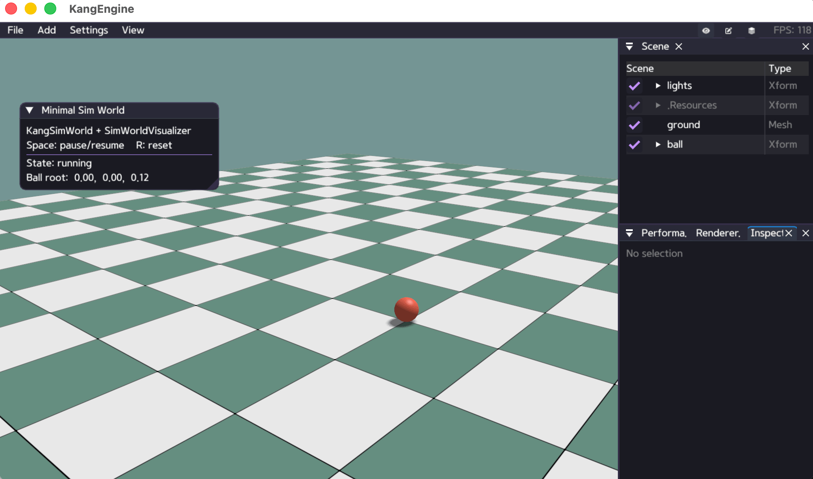

# Camera and Viewer

Set an initial camera with the application helper:

```python
self.set_camera_view(
    [3.0, -4.0, 2.2],
    [0.0, 0.0, 0.7],
)
```

For direct control:

```python
camera = self.get_camera()
camera.set_near_plane(0.05)
camera.set_far_plane(5000.0)
camera.set_fov(58.0)
camera.set_camera_pos(ke.Vec3(0.0, 4.0, 14.0))
camera.set_target_pos(ke.Vec3(0.0, 1.0, 0.0))
```

Use `ke.keys` in lifecycle callbacks for keyboard interaction and `ke.imgui`
for small panels. See `python/examples/sim_world_minimal.py` for pause/reset
controls and a state panel.

Viewer capture shortcuts:

- `T`: save one screenshot.
- `Shift+T`: start or stop video recording.


