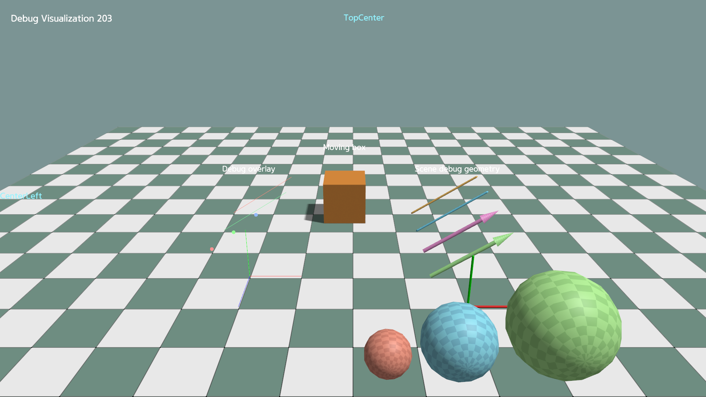

# Debug Visualization and Text Rendering

KangEngine provides separate helpers for temporary visualization and text:

- `app.debug_overlay` draws lines, points, and axes without creating scene
  Prims.
- `app.scene.debug_geometry` creates mesh-based debug objects in the
  SceneGraph.
- `app.world_text` draws screen-aligned text at a 3D world position.
- `app.screen_text` draws text in viewport pixel coordinates.



## Debug overlay

Use `debug_overlay` for lightweight lines, points, and axes that do not create
SceneGraph Prims:

```python
self.debug_overlay.axes(
    path="/overlay/axes",
    origin=np.array([0.0, 0.0, 0.0]),
    rotation=np.eye(3),
    length=1.0,
)
```

Calling the same function with the same path replaces its data. Remove overlay
data by path:

```python
self.debug_overlay.clear_lines("/overlay/lines")
self.debug_overlay.clear_points("/overlay/points")
self.debug_overlay.clear("/overlay/axes")
```

## Scene debug geometry

`scene.debug_geometry` creates mesh-based, instanced SceneGraph renderables.
Keep the returned view to update or remove them:

```python
self.debug_spheres = self.scene.debug_geometry.add_spheres(
    path="/debug_geometry/spheres",
    centers=centers,
    radii=radii,
    colors=colors,
)

self.debug_spheres.update_spheres(
    centers=new_centers,
    radii=radii,
    colors=colors,
)
self.debug_spheres.remove()
```

Lines and arrows provide matching `update_lines()` and `update_arrows()`
methods.

## World-space text

Create the entry once, then update only the values that change:

```python
self.world_text.set(
    path="/labels/box",
    text="Box",
    position=ke.Vec3(0.0, 1.2, 0.0),
    pixel_size=28.0,
)

self.world_text.set_position("/labels/box", new_position)
self.world_text.set_text("/labels/box", "Moving box")
self.world_text.remove("/labels/box")
```

Set `depth_test=False` when the label should remain visible through scene
geometry.

## Screen-space text

`position` is measured in pixels from the selected anchor. Without an explicit
anchor, it uses `TopLeft`, so `(24, 24)` places the text 24 pixels right and
down from the top-left corner:

```python
self.screen_text.set(
    path="/status",
    text="Ready",
    position=ke.Vec2(24.0, 24.0),
    anchor=ke.render.ScreenAnchor.TOP_LEFT,
)

self.screen_text.set_text("/status", "Running")
self.screen_text.remove("/status")
```

When `alignment` is omitted, it follows the anchor column automatically:
left, center, or right. Pass an explicit alignment to override it.

Run the complete example:

```bash
python ./python/examples/debug_visualization.py
```

<details>
<summary>Complete source: <code>debug_visualization.py</code></summary>

```{literalinclude} ../../../../python/examples/debug_visualization.py
:language: python
:linenos:
```

</details>
