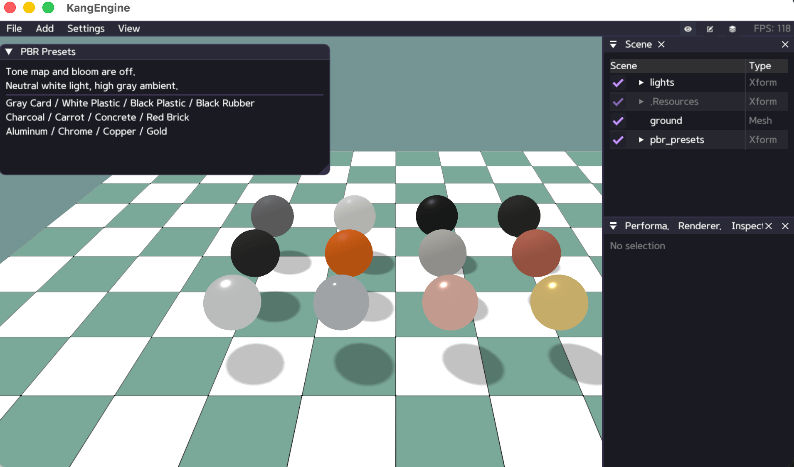

# Materials and Textures

Materials describe how a mesh surface should look. This page shows how to use
the built-in materials, create independent Phong and PBR materials, attach
textures, and assign the result to a scene mesh.

Most applications only need `self.scene` and `ke.material`. The custom graphics
pipeline section at the end is optional and intended for rendering experiments.

Examples assume `import kangengine as ke` and run inside an `App` subclass, so
the current application and its scene are accessed as `self` and `self.scene`.

## API namespaces

KangEngine separates normal scene authoring from low-level rendering:

| Namespace | Use it for |
| --- | --- |
| `self.scene` | Adding meshes, ground planes, and imported assets to the scene |
| `ke.material` | Material classes, presets, and vertex-color styles |
| `ke.render` | Textures, GPU buffers, custom pipelines, and render hooks |

For ordinary meshes, create a material and pass it to
`self.scene.add_mesh()`.

## Standard materials

`create_standard_materials()` creates a cached bundle of shared materials used
by common scene, debug, ground, and character workflows. Calling it again
returns the same bundle unless `force=True` is supplied.

The simplest ground call automatically uses the shared checkerboard material
from the standard bundle:

```python
ground = self.scene.add_ground()
```

Obtain the bundle directly when you want to reuse one of its materials or
replace the ground material explicitly:

```python
materials = self.create_standard_materials()
ground = self.scene.add_ground(
    path="/diagnostic_ground",
    material=materials.debug_checker,
)
```

The bundle contains:

| Name | Purpose |
| --- | --- |
| `common`, `debug`, `skinned`, `skinned_debug` | Untextured vertex/display color |
| `common_texture`, `skinned_texture` | Textured vertex/display color |
| `ground` | Checkerboard ground |
| `debug_checker`, `skinned_debug_checker` | Diagnostic UV grid and checker pattern |
| `phong`, `skinned_phong` | Default Phong surface |
| `pbr`, `skinned_pbr` | Default PBR surface |

These are shared defaults. Changing one changes every object using that same
material. Create a separate material when an object needs its own editable
surface values.

## Create a Phong material

Phong is useful for simple colored surfaces and assets described with diffuse,
specular, and shininess values.

```python
material = self.create_phong_material(
    diffuse=ke.Vec3(0.8, 0.3, 0.1),
    specular=ke.Vec3(0.2, 0.2, 0.2),
    shininess=32.0,
)

mesh = self.scene.add_mesh("/orange_mesh", mesh_data, material)
```

`create_phong_material()` returns a new retained material on every call.
Available texture inputs are `diffuse_map`, `specular_map`, `alpha_map`, and
`normal_map`.

## Create a PBR material

PBR is a better fit for metallic-roughness assets and surfaces that should
respond more consistently to different lighting environments.

```python
material = self.create_pbr_material(
    base_color=ke.Vec4(0.8, 0.3, 0.1, 1.0),
    metallic=0.0,
    roughness=0.6,
)

mesh = self.scene.add_mesh("/pbr_mesh", mesh_data, material)
```

Phong and PBR parameters are intentionally different. Replacing a Phong
material with a PBR material does not translate `diffuse` and `shininess` into
`base_color` and `roughness`.

## Load and attach textures

`App.load_texture()` loads a texture through `ke.render`, retains it for the
application lifetime, and reuses it when the same normalized path is requested
again.

Phong example:

```python
diffuse = self.load_texture("assets/wood_base_color.png")
normal = self.load_texture("assets/wood_normal.png")

material = self.create_phong_material(
    diffuse=ke.Vec3(1.0, 1.0, 1.0),
    diffuse_map=diffuse,
    normal_map=normal,
)
```

PBR example:

```python
base_color = self.load_texture("assets/metal_base_color.png")
orm = self.load_texture("assets/metal_orm.png")

material = self.create_pbr_material(
    base_color=ke.Vec4(1.0, 1.0, 1.0, 1.0),
    base_color_texture=base_color,
    orm_texture=orm,
)
```

Material color factors multiply their corresponding textures. Use a white
factor when the texture should appear without an additional tint.

OBJ/MTL imports create material subsets automatically and attach supported
diffuse, specular, alpha, and normal textures. See
[Load Assets](LOAD_ASSETS.md) for the import workflow.

## Mesh rendering options

Shadow casting, face culling, and alpha handling belong to the renderable mesh,
not to the material itself:

```python
mesh = self.scene.add_mesh("/mesh", mesh_data, material)
mesh.set_casts_shadow(True)
mesh.set_double_sided(False)
mesh.set_alpha_mode(ke.render.AlphaMode.OPAQUE)
```

Use double-sided rendering for surfaces that must be visible from both sides.
For cutout textures use `AlphaMode.MASK`; for partial transparency use
`AlphaMode.BLEND`.

## Vertex-color styles

Vertex-color materials use the mesh or instance display color and are useful
for visualization, debug geometry, and lightweight scene objects.

```python
plain = self.create_vertex_color_material()
textured = self.create_vertex_color_material(
    style=ke.material.VertexColorStyle.TEXTURED
)
checker = self.create_vertex_color_material(
    style=ke.material.VertexColorStyle.CHECKERBOARD
)
debug_checker = self.create_vertex_color_material(
    style=ke.material.VertexColorStyle.DEBUG_CHECKER
)
```

`DEBUG_CHECKER` overlays a fine/coarse UV grid and checker pattern. It is useful
for finding distorted or missing UV coordinates.

## Shader and pipeline sharing

KangEngine selects and reuses the appropriate built-in pipeline from the
material, mesh, and render settings. Creating many materials does not compile
the same built-in shader repeatedly.

The Resource panel exposes built-in shader sources and logical pipeline
families for inspection. A pipeline entry can be expanded to show its shader
sources and variants, such as static/skinned or opaque/transparent.

## Custom rendering

Drawing geometry outside the normal scene-mesh path is an advanced workflow.
See [Custom Graphics Pipelines](../advanced/CUSTOM_GRAPHICS_PIPELINES.md) for
buffer layouts, shader stages, render hooks, resource tracking, and a runnable
triangle example.

## Examples

- `python/examples/test_phong_texture.py`
- `python/examples/view_obj_scene.py`
- `python/examples/view_pbr.py`
- `python/examples/view_pbr_presets.py`


