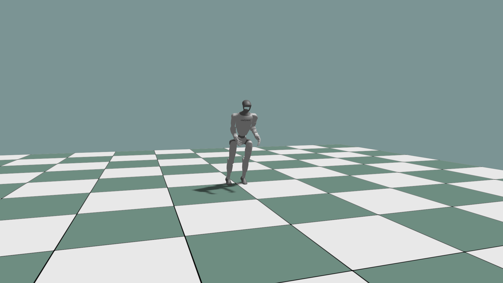
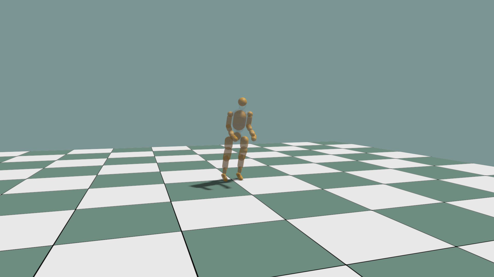

# Articulations

MJCF, URDF, and USD loaders produce a common `ArticulationDesc`.
Load a robot, then pass its data to `world.add_articulation()`.

To create a robot without an asset file, use [ArticulationBuilder](ARTICULATION_BUILDER.md).

## Load a robot

Choose the loader for your file:

```python
# world is an existing KangSimWorld.
data: ke.asset.ArticulationDesc = world.load_mjcf("robot.xml", order="DFS")
# Or:
data = world.load_urdf("robot.urdf", order="DFS")
data = world.load_usd("robot.usd", order="DFS")
```

USD requires a native build with `USE_USD` enabled. It selects the default
prim; pass `prim_path="/Robot"` to select a different robot subtree.

| Format | Supported joints | 3-axis rotation |
| --- | --- | --- |
| MJCF | Fixed, Revolute (hinge), Spherical (ball) | Spherical or 3 orthogonal Revolute joints on one body |
| URDF | Fixed, Revolute, Prismatic | 3 Revolute joints with intermediate links |
| USD | Fixed, Revolute, Prismatic | 3 Revolute joints with intermediate links |

MJCF `ball` imports as a spherical joint with three free rotational DOFs;
rotation-angle limits are not supported. MJCF `slide` and USD Spherical
joint import are not supported.

## Create the articulation

```python
config = ke.physics.ArticulationConfig.free_base()

record = world.add_articulation(
    data,
    env_id=0,
    obj_id=0,
    name="robot",
    config=config,
)
robot = record.articulation
```

For all three formats, choose `ArticulationConfig.free_base()` for a floating
root or `ArticulationConfig.fixed_base()` for a fixed root.

The following visualization example uses an MJCF asset:

Use the same `order` for loading and visualization.

```python
robot_visual = visual.add_articulation_scene_graph(
    0,
    0,
    mjcf_path,
    path="/robot",
    order="DFS",
    material=robot_material,
)
```

## Attachment frames

Use frames for end-effectors, sensors, or tool mounts that need a named pose
without a separate physical body.

A frame is a named attachment point with a position and orientation fixed
relative to a body. MJCF sites are imported as fixed frames. Empty non-root
fixed links with no inertial, visual, or collision data are also imported as
frames instead of physical bodies. The original skeleton remains available
for animation and retargeting.

### Find and read

Read after a completed simulation step. On CPU, call `world.state.refresh()`
if you have stepped or reset physics without refreshing state.

```python
import torch

print(robot.body_names)  # Physical bodies, in body-state array order.
print(robot.frame_names)  # Named attachments, queried separately.

names = robot.frame_names[:1]  # Example: select the first available frame.
position: torch.Tensor = world.state.get_frame_pos(obj_id=0, frame_names=names)
rotation: torch.Tensor = world.state.get_frame_rot(obj_id=0, frame_names=names)
```

Positions are in world coordinates; rotations are world-space xyzw quaternions.
Shapes are `(num_envs, len(names), 3)` and `(num_envs, len(names), 4)`, in the
requested name order. Body, contact, and joint-wrench arrays exclude frames.
A body and a site may share a name; frame queries select the site.

GPU frame queries return CUDA tensors without host readback. Use `fetch=False`
only when body poses have already been fetched for the current simulation state.

### Add

For a new robot with a custom frame, use this in place of the creation example
above. Add frames before creating the robot or template; changing `data` later
does not update an existing robot.

`FixedFrameDesc.body_index` refers to the source `data.skeleton_tree` index.
It is not an index into `robot.body_names`.

```python
frame: ke.asset.FixedFrameDesc = ke.asset.FixedFrameDesc(
    "tool_sensor",
    body_index=0,
    pos=[0.0, 0.0, 0.1],
)
data.add_fixed_frame(frame=frame)
record: ke.sim.SimArticulation = world.add_articulation(
    data,
    env_id=0,
    obj_id=0,
    config=ke.physics.ArticulationConfig.free_base(),
)
robot = record.articulation
```

This places `tool_sensor` 0.1 m along the source body's local Z axis.
Frames do not create collision shapes or contact sensors. To attach one to
the world with a constraint, use `D6Batch.create_world_frames()`; see
[D6 joints](D6_JOINTS.md).

### Visualize

Frame axes are off by default. Using the names selected above:

```python
visual.set_frames_visible(obj_id=0, visible=True, env_id=0, frame_names=names)
visual.set_frames_visible(obj_id=0, visible=False, env_id=0)  # Clear and stop queries.
```

Axes update during `visual.sync()`. While enabled, this debug display copies
selected CUDA poses to the host. The MJCF/URDF DOF examples provide a
**Show attachment frames** checkbox.

## Joint wrenches and efforts

### Read joint effort

Read the solver-computed effort transmitted through each articulation DOF after
a completed simulation step:

```python
import torch

# All environments, logical DOF order: (num_envs, num_dofs).
effort: torch.Tensor = world.state.get_dof_projected_joint_forces(obj_id=0)
```

The effort is computed by projecting the total parent-to-child incoming
joint wrench onto each joint's motion axes. Revolute and spherical DOFs report
torque in N·m; prismatic DOFs report force in N. This follows the semantics of Isaac's
`get_dof_projected_joint_forces`.

The incoming wrench is expressed at the child joint origin in the child joint
frame, including authored anchor offsets and axis rotations.

### Read link wrench

Read the full parent-to-child force and torque for each physical link, including
links connected by fixed joints with no DOFs. Empty links preserved only as
attachment frames have no separate wrench row:

```python
# All environments, logical body/link order: (num_envs, num_links, 6).
wrenches: torch.Tensor = world.state.get_link_incoming_joint_forces(obj_id=0)
# Last dimension: [Fx, Fy, Fz, Tx, Ty, Tz], in N and N·m.
```

Each wrench uses the child joint origin and axes described above, not the link
COM or world frame. The root row is zero because it has no incoming joint.

For example, when a hand pushes against a wall, this reports the force and
torque transmitted through the wrist to the hand. Contact and collision loads
affect this reading, as do loads induced by gravity and acceleration; it does
not isolate the wall's contact force.

### Choose a force API

| API | Returns | Typical use |
| --- | --- | --- |
| `world.state.get_link_incoming_joint_forces(obj_id=...)` | Force and torque transmitted from the parent joint to each link | Measuring wrist loads when a hand pushes against a wall, including through fixed joints |
| `world.state.get_dof_projected_joint_forces(obj_id=...)` | Solver-computed force/torque transmitted through each articulation DOF | Joint effort observation, load monitoring, reward/penalty calculation |
| `robot.get_dof_forces()` | Commanded force/torque buffer | Inspecting actuator commands sent to the articulation |
| `D6Joint.get_wrench()` | Constraint wrench of a specific external D6 joint | Measuring loads at hand/foot attachments or other external constraints |

Projected joint effort includes transmitted loads. It is neither a PD estimate
nor the isolated wrench of an attached D6 joint.

**Projected joint effort is not clamped to the actuator's effort limit.**

### CPU and GPU behavior

CPU scenes read a reusable PhysX articulation cache. For a standalone CPU
articulation, `robot.get_dof_projected_joint_forces()` returns a NumPy array of
shape `(D,)`; `robot.get_link_incoming_joint_forces()` returns `(B, 6)`.

GPU scenes fetch the existing incoming-wrench buffer and select logical links
or DOF components with Torch CUDA; there is no host readback. Both results reuse
storage, so use `.clone()` when retaining a sample. Advanced callers can use
`world.state.gpu.get_link_incoming_joint_forces(obj_id=0, fetch=False)` or
`world.state.gpu.get_dof_projected_joint_forces(obj_id=0, fetch=False)` to reuse
the last incoming-wrench fetch.

## Control

Run the complete control example with an MJCF file:

```bash
python ./python/examples/mjcf_dof_control.py /path/to/robot.xml
```

<details>
<summary>Complete source: <code>mjcf_dof_control.py</code></summary>

```{literalinclude} ../../../../python/examples/mjcf_dof_control.py
:language: python
:linenos:
```

</details>

| MJCF articulation | Collision debug |
|---|---|
|  |  |

## USD import requirements

Prepare a USD robot with:

- Z-up, `metersPerUnit = 1`, and `kilogramsPerUnit = 1`.
- One connected body tree with explicit positive mass and inertia.
- `convexHull` collision meshes and no joint connecting the root to the world.

Configure initial states, drives, simulation settings, and materials after
loading. These scene settings are not fully reproduced by the importer.
Unsupported joint or collider configurations raise errors; inspect warnings
for omitted properties:

```python
result: ke.asset.USDArticulationImportResult = ke.asset.USDLoader.parse_articulation(
    usd_path="robot.usd", prim_path="/Robot"
)
print(result.diagnostics.warnings)
```
