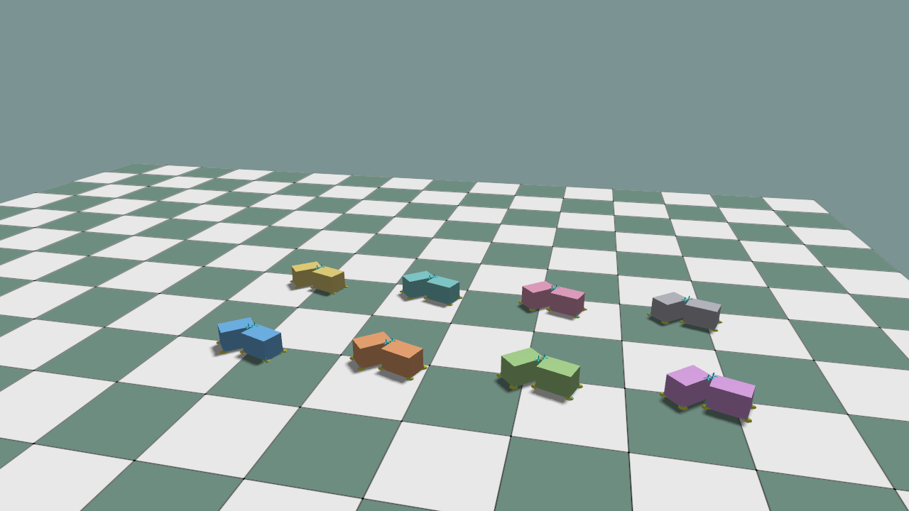

# Contact Sensors

Contact sensors attach to a rigid or articulation simulation view. The current
GPU sensor reports contact count, contact mask, and accumulated normal impulse.

```python
rigids = world.get_rigid_batch(obj_id=0)
contact = rigids.add_contact_sensor(body_ids=[0], name="contact")
force = rigids.add_force_sensor(body_ids=[0], name="force")

world.step()

counts = contact.contact_count
in_contact = contact.in_contact
impulse = contact.net_impulse
average_normal_force = force.force

points = contact.contact_points()
positions_w = points.position_w
normals_w = points.normal_w
normal_impulses_w = points.normal_impulse_w
```

`ForceSensor.force` is `net_impulse / world.sim_dt`. It is not a full six-axis
wrench: tangential friction impulse and contact torque are not present.

`ContactSensor.contact_points()` selects the current packed PhysX contacts for
that sensor without copying them off CUDA. Its variable-length outputs include
`environment`, `body_slot`, the other endpoint's body reference, `position_w`,
`normal_w`, `normal_impulse_w`, and `separation`. Cartesian fields preserve the
PhysX world frame; normals and normal impulses are oriented toward the selected
sensor body. Use these raw values in Python/Torch for object-frame conversion,
contact filtering, friction-cone approximations, and wrench-space metrics.

The packed impulse contains the solver's normal component only. Coulomb-cone
edges and primitive wrenches are deliberately not generated by the engine,
because their discretization, reference frame, and filtering policy belong to
the sensor or learning task.

`normal_impulse_wrench_about(reference_position_w)` requires the moment
reference point explicitly and returns `[linear impulse, angular impulse]` in
world axes. Pass each body/link origin if a body-origin wrench is desired, then
rotate the result in Python when an object-frame representation is required.

```python
normal_wrenches_w = points.normal_impulse_wrench_about(reference_positions_w)
```

The high-level GPU example keeps all sensor outputs as Torch CUDA tensors:

```bash
python ./python/examples/sim_gpu_contact_sensor.py --num-envs 8
python ./python/examples/sim_gpu_contact_sensor.py --num-envs 8 --viewer
```

The second command requires Linux/NVIDIA CUDA/OpenGL interop.

<details>
<summary>Complete source: <code>sim_gpu_contact_sensor.py</code></summary>

```{literalinclude} ../../../../python/examples/sim_gpu_contact_sensor.py
:language: python
:linenos:
```

</details>


