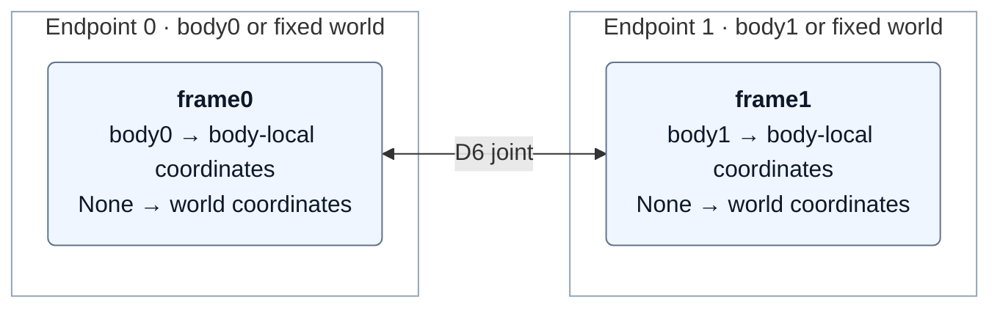

# Attaching bodies with D6 joints

A D6 joint lets you lock, limit, or free each of six relative degrees of freedom: three translations and three rotations.
For details, see the [PhysX D6 joint guide](https://nvidia-omniverse.github.io/PhysX/physx/5.8.0/docs/Joints.html#d6-joint).

Use a D6 joint to attach a robot hand or foot to a fixed point, or connect it to
another body. You can disable and re-enable the attachment without rebuilding the robot.

## Try the interactive example

```bash
python ./python/examples/kw_d6_control.py
```

KW5 starts hanging from its wrists. J/K toggle the hands, N/M toggle the feet,
and R resets. The panel also provides attachment checkboxes, release-all, and
root-force sliders. Enter pauses/plays; Space advances one step. Green points
show active anchors and gray points show inactive ones.

## Attach a hand to the world

This snippet assumes `physics_world` and `robot` already exist. Set
`current_hand_world_position` from the robot's freshly read link state.

```python
import kangengine as ke

config = ke.physics.D6JointConfig()
# Lock translation; leave rotation free.
# Axis order: X, Y, Z, TWIST, SWING1, SWING2.
config.locked_axes = [True, True, True, False, False, False]
config.frame0 = [*current_hand_world_position, 0, 0, 0, 1]
config.frame1 = [0, 0, 0, 0, 0, 0, 1]
config.enabled = False
joint: ke.physics.D6Joint = physics_world.create_d6_joint(
    None, robot.link("LeftWrist"), config=config
)
joint.set_enabled(True)
```

`None` means the fixed world. `robot.link(name_or_index)` selects the other
endpoint. Keep `joint` alive for as long as you need the attachment.

### What do the frames mean?

A frame is `[x, y, z, qx, qy, qz, qw]`, with position in meters and a normalized
quaternion. `frame0` is expressed in endpoint 0's coordinate system;
`frame1` is expressed in endpoint 1's coordinate system. If an endpoint is
`None`, it is the fixed world and its frame uses world coordinates.

| Endpoint | Frame coordinates |
| --- | --- |
| `None` | World coordinates |
| Robot link or rigid body | Local to that body's origin, not its center of mass |



An identity link frame attaches at the link origin. For an attachment elsewhere
on the hand, supply its local pose instead. Its matching world pose is
`link_world_pose * link_local_frame`.

Before enabling, make the two attachment positions coincide. If rotation is
locked, also align their orientations. The example leaves all rotation free,
so only the attachment positions need to match.

## Release and reattach

```python
joint.set_enabled(False)
# Let the robot move, then refresh its state and read the new hand position.
joint.set_frame0([*new_hand_world_position, 0, 0, 0, 1])
joint.set_enabled(True)
```

Keep the world anchor fixed while holding. Capture a new attachment pose only
when reattaching. For reset, disable the affected joints first, reset the robot,
refresh its poses, update the frames, then enable the joints.

Use `set_frame1()` to change endpoint 1's attachment frame, or `set_frames()`
to change both frames. Repeated `joint.release()` calls are safe.

| Operation / state | Effect and reuse |
| --- | --- |
| `set_enabled(False)` | Temporarily disables the constraint; use `set_enabled(True)` to reattach. |
| `release()` | Permanently releases the joint; the handle becomes invalid and cannot be reused. |
| Broken joint | Handle remains valid for inspection, but cannot be re-enabled. Create a new joint to attach again. |

## Control multiple attachments

`D6Batch` lets you select joints by index. Here both links belong to the same robot:

```python
joints: ke.physics.D6Batch = ke.physics.D6Batch.create_world_links(
    physics_world,
    [robot, robot],
    [left_link_id, right_link_id],
    world_frames=[left_world_frame, right_world_frame],
    link_frames=[[0, 0, 0, 0, 0, 0, 1]] * 2,
)
joints.set_enabled([0, 1], True)
joints.set_enabled([0], False)
joints.set_world_frames([0], [new_left_world_frame])
joints.set_enabled([0], True)
```

Frame inputs have shape `[N, 7]`. Lists, NumPy arrays, and CPU/CUDA Torch tensors
are accepted. When updating a subset, pass only its frames, in selected-index
order. CUDA frame inputs are copied to CPU and synchronize that transfer;
D6Batch does not make joint configuration updates run on GPU.

For a hand attached to a sphere, use the general factory. Supply matching
attachment poses in each body's local coordinates:

```python
joints: ke.physics.D6Batch = ke.physics.D6Batch.create(
    physics_world,
    bodies0=[robot.link("LeftWrist")],
    bodies1=[sphere],
    frames0=[hand_local_frame],
    frames1=[sphere_local_frame],
)
joints.set_enabled([0], True)
```

`set_frames0()` and `set_frames1()` update either side while detached.
`joints.release()` releases all joints in the batch.

The batch API also provides `set_motion`, `set_linear_limit`, `set_twist_limit`,
`set_swing_limit`, `set_drive`, `set_drive_velocity`, and `set_break_force`, each
with `indices` followed by the individual-joint arguments. `set_drive_targets`
accepts one `[N, 7]` pose per selected joint. Shared settings apply to all selected
joints. These methods validate configurations before applying updates.

## Axis limits and drives

Each axis supports `D6Motion.LOCKED`, `LIMITED`, or `FREE`. The axis order is
X, Y, Z, TWIST, SWING1, SWING2 in the joint frame. `locked_axes` remains a
convenience setter: `True` selects LOCKED and `False` selects FREE, overwriting
any LIMITED setting. Set `motions` when using limits.

For example, create a slider driven toward a target inside a 40 cm range:

```python
p = ke.physics
config: ke.physics.D6JointConfig = p.D6JointConfig()
config.frame0 = world_attachment_frame
config.frame1 = body_attachment_frame
config.motions = [p.D6Motion.LIMITED] + [p.D6Motion.LOCKED] * 5  # Limit X.
config.linear_limits = [[-0.2, 0.2], [-1.0, 1.0], [-1.0, 1.0]]
config.drives = {  # Configure the X drive.
    p.D6DriveAxis.X: p.D6DriveConfig(stiffness=500, damping=40, force_limit=100)
}
config.drive_target = [0.1, 0, 0, 0, 0, 0, 1]
config.enabled = True
joint: ke.physics.D6Joint = physics_world.create_d6_joint(None, body, config=config)

joint.set_linear_limit(axis=p.D6Axis.X, lower=-0.3, upper=0.3)  # Runtime updates.
joint.set_drive_target(pose=[0.2, 0, 0, 0, 0, 0, 1])
joint.set_drive_velocity(linear=[0, 0, 0], angular=[0, 0, 0])
```

Linear limits use meters. `twist_limits=[lower, upper]` uses radians, with
`-2*pi < lower < upper < 2*pi`. `swing_limits=[y_angle, z_angle]` specifies the
elliptical cone half-angles, each in `(0, pi)`. Runtime setters are
`set_twist_limit()` and `set_swing_limit()`. Limits apply only to LIMITED axes;
changing a limit does not change the axis motion. These are hard limits;
soft-limit stiffness, damping, and restitution are not exposed.

A drive is a position/orientation spring plus velocity damping. Its target is
the desired pose of frame1 relative to frame0; linear and angular target
velocities use frame0 axes, in m/s and rad/s. Drive axes are X, Y, Z, TWIST,
SWING, and SLERP. SWING applies the same settings to both swing axes. SLERP
requires all angular axes unlocked and cannot be active together with SWING or
TWIST drives. `acceleration=True` asks PhysX to scale drive gains by effective
mass/inertia; the force cap still applies.

`force_limit` caps each drive's force in N or torque in N·m, not its impulse.
It does **not** cap forces from locked axes or hard limits, nor the total joint
wrench. Set a drive's `force_limit=0`, or set both gains to zero, to turn off that
motor. Locks and limits remain active; use `set_enabled(False)` to disable the
whole constraint. Defaults have zero gains and maximum finite force/break caps;
all numeric settings must be finite.

`joint.config` returns an independent snapshot. Changing that snapshot has no
runtime effect; use the setters to update the live joint. Config sequence and
dictionary fields are copied into/out of Python, so assign the whole field
instead of editing a nested element in place.

## Break thresholds and force readback

```python
joint.set_break_force(force=1000, torque=100)  # N, N·m
physics_world.step()
force_and_torque = joint.get_wrench()  # [Fx, Fy, Fz, Tx, Ty, Tz]
if joint.broken:
    joint.release()  # Create a new joint to attach again.
```

`get_wrench()` reads the last solver result in world axes, signed as the force
and torque on endpoint 1. Torque is reported about the frame1 attachment,
not the body center of mass. It includes constraint and drive contributions,
but not unrelated contacts or external forces. Read after a completed step;
reading an enabled joint before its first step raises an error. Disabled or
broken joints return zeros. A broken joint remains a valid handle but reports
`enabled=False`; it cannot be re-enabled. Break thresholds use PhysX's reported
wrench and are not force clamps. A sleeping constraint may retain its last solver result.

In PhysX 5.8, TGS can report incorrect torque; PGS CPU produced the expected torque in the tested cases.

`joint.get_wrench()` and `D6Batch.get_wrenches()` return host data and synchronize
on Direct GPU scenes. The batch getter returns a NumPy float32 `[N, 6]` array
in selected-index order, reading joints individually. Use these for inspection;
use the CUDA fetch path below for repeated GPU tensor processing.

<details>
<summary>Advanced: GPU wrench readback with Torch CUDA</summary>

Pass your initialized `PhysicsGpuSystem` on the first fetch. For `KangSimWorld`,
use `world.gpu_system` after `world.init_gpu_system()`. With a low-level
`PhysicsWorld`, initialize its `PhysicsGpuSystem` explicitly first.

```python
# After completing a simulation step:
joints.fetch_wrenches(gpu_system=world.gpu_system)
wrenches = joints.wrenches  # Torch CUDA float32 [N, 6], in joints.joints order
forces = wrenches[:, :3]
loads = forces.norm(dim=-1)
selected = wrenches[cuda_joint_indices]  # Selection also stays on CUDA.

# After the next completed simulation step:
joints.fetch_wrenches()  # Reuse the connected system and output allocation.
snapshot = joints.wrenches.clone()  # Optional independent CUDA snapshot.
```

The GPU system reads all active joints with two PhysX calls: one for forces,
one for torques. A CUDA kernel packs and signs the result directly into the
Torch-owned output tensor. There is no intermediate NumPy array or host force
buffer. Invalid/released handles raise an error before output is changed;
disabled or broken joints have zero rows. An empty batch yields `[0, 6]`.

`fetch_wrenches()` operates on the current Torch CUDA stream and orders the
PhysX copies with CUDA events. Consume the result on that stream. If another
stream reads the tensor, explicitly order that read and its completion before
the next fetch overwrites the buffer, as with other shared mutable Torch tensors.
`wrenches` requires a successful fetch; it never initiates a read on its own.

Every fetch updates the same tensor. Use `.clone()` to preserve values across
fetches. Torch owns the allocation, so a tensor retained by the caller remains
valid after the batch releases its joints or the GPU system is invalidated.
No CPU fallback is performed if the GPU system is missing or uninitialized.

Handle validation and GPU-index bookkeeping still run on CPU. The first fetch,
capacity growth, or changes to the joint list/active rows can allocate or
synchronize index metadata. Repeated fetches with the same layout reuse the
buffers without host synchronization or CPU/GPU data transfers. This does not
change the TGS torque-reporting limitation above.

For caller-managed buffers, `gpu_system.fetch_d6_wrenches(joints, output)`
accepts a `GpuArrayView` over contiguous CUDA float32 `[N, 6]` storage on the
physics device. It uses the view's stream, updates its completion event, and
requires the caller to retain the allocation until the stream completes.
Use `ke.utils.to_gpu_array_view()` to wrap an existing CUDA tensor.

</details>

## Timing and lifecycle

- Create, update, or release joints between completed physics steps, on the
  same thread that advances the simulation.
- Both bodies must belong to the same physics world, and at least one endpoint
  must be dynamic or an articulation link. Both endpoints cannot be `None`.
- Removing an endpoint invalidates its connected joints. Check `joint.valid`
  before reusing such a handle; updates to an invalid joint raise an error.
- D6 attachments connect existing bodies. To define the robot's internal hinges
  or sliders, use [ArticulationBuilder](ARTICULATION_BUILDER.md).
