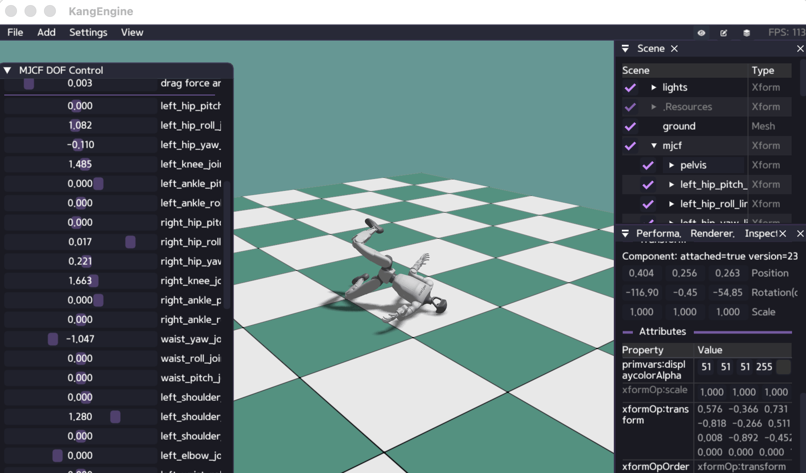

# Control DOFs

Position control uses a target per DOF plus proportional and derivative gains.

```python
targets = np.zeros(robot.num_dofs(), dtype=np.float32)

world.set_cmd(
    None,
    obj_id,
    targets,
    mode=ke.sim.ControlMode.POS,
    kp=120.0,
    kd=12.0,
)
world.step(substeps=4)
```

The first argument selects environments. Use an integer for one environment,
`None` for all environments, or a sequence/tensor for a selected batch.

Available command modes include position, velocity, torque, and the explicit
PD path used by advanced GPU control. Start with `ControlMode.POS` for an MJCF
robot with configured joint limits.

Run:

```bash
python ./python/examples/mjcf_dof_control.py /path/to/robot.xml
```

The example exposes every DOF as an ImGui slider and also demonstrates animated
targets, reset, collision visualization, and force dragging.

The [MJCF articulation guide](MJCF_ARTICULATION.md) includes the complete
`mjcf_dof_control.py` source.


