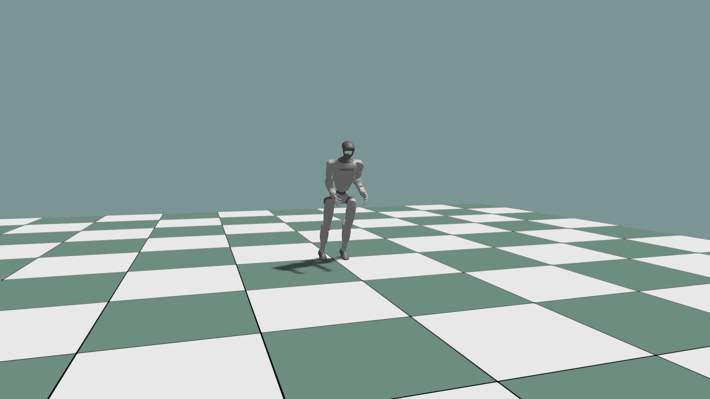
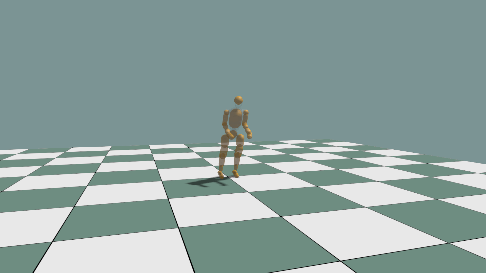

# Load an MJCF Articulation

Use `world.load_mjcf(...)` to parse an MJCF file and
`world.add_articulation(...)` to create the live simulation object.

```python
data = world.load_mjcf(mjcf_path, order="DFS")
config = ke.physics.ArticulationConfig.free_base()

record = world.add_articulation(
    data,
    env_id=0,
    obj_id=0,
    name="robot",
    config=config,
)
robot = record.articulation
```

Use `ArticulationConfig.fixed_base()` for a fixed root. Keep the same traversal
order when creating articulation visuals so simulation body indices and visual
body indices agree.

```python
robot_visual = visual.add_articulation_scene_graph(
    0,
    0,
    mjcf_path,
    prim_base_path="/robot",
    order="DFS",
    material=robot_material,
)
```

Run the complete control example with an MJCF file:

```bash
python ./python/examples/mjcf_dof_control.py /path/to/robot.xml
```

| MJCF articulation | Collision debug |
|---|---|
|  |  |
