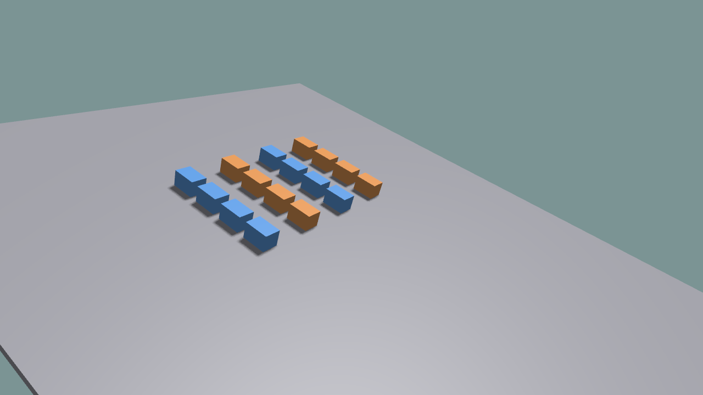

# Multi-Environment Simulation

Create the world with the desired environment count, register the same object
id in each environment, and retrieve a batched view.

```python
world = ke.sim.KangSimWorld(num_envs=16, sim_dt=1.0 / 120.0)

for env_id in range(16):
    world.add_rigid(
        box_data,
        env_id=env_id,
        obj_id=0,
        name=f"box_{env_id}",
        pos=positions[env_id],
    )

boxes = world.get_rigid_batch(obj_id=0)
```

State and reset values are batched along the first dimension:

```python
positions = torch.zeros((16, 3), dtype=torch.float32)
rotations = torch.zeros((16, 4), dtype=torch.float32)
rotations[:, 3] = 1.0

boxes.set_root_state(None, positions, rotations)
root_pos = boxes.get_root_pos()  # shape: [16, 3]
```

Run:

```bash
python ./python/examples/sim_world_multi_env.py --num-envs 16
```

The example compares low- and high-friction groups on a ramp and displays
batched state statistics.


