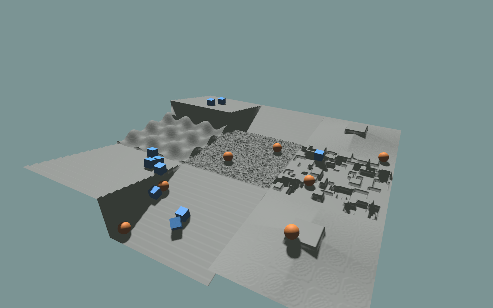

# Procedural Terrain and Collision

KangEngine can generate tiled height-field terrain in Python, render it as one
continuous mesh, and use the same height samples for PhysX collision.

The complete example mixes stairs, slopes, waves, random ground, and discrete
obstacles:

```bash
python ./python/examples/view_procedural_terrain.py
```

It also drops dynamic spheres and boxes onto the terrain to verify that the
rendered surface and PhysX heightfield agree. Press `R` to reset the bodies.

<details>
<summary>Complete source: <code>view_procedural_terrain.py</code></summary>

```{literalinclude} ../../../../python/examples/view_procedural_terrain.py
:language: python
:linenos:
```

</details>



## Generate the height field

`TerrainGrid` joins adjacent tiles with a shared edge, producing one continuous
height field rather than separate mesh islands.

```python
import numpy as np
import kangengine as ke


rng = np.random.default_rng(7)
terrain_types = ("stairs", "slope", "wave", "random", "obstacles")

grid = ke.terrain.TerrainGrid(
    rows=3,
    cols=3,
    tile_width=96,
    tile_length=96,
    horizontal_scale=0.05,
    vertical_scale=0.005,
)


def generate_tile(tile, row, col):
    kind = terrain_types[(row * grid.cols + col) % len(terrain_types)]
    if kind == "stairs":
        ke.terrain.stairs_terrain(tile, step_width=0.35, step_height=0.08)
    elif kind == "slope":
        ke.terrain.sloped_terrain(tile, slope=0.18)
    elif kind == "wave":
        ke.terrain.wave_terrain(tile, num_waves=3.0, amplitude=0.35)
    elif kind == "random":
        ke.terrain.random_uniform_terrain(
            tile, -0.05, 0.05, step=0.01, rng=rng
        )
    else:
        ke.terrain.discrete_obstacles_terrain(
            tile,
            max_height=0.25,
            min_size=0.2,
            max_size=0.7,
            num_rects=80,
            platform_size=1.0,
            rng=rng,
        )
    return tile


grid.fill(generate_tile)
```

`horizontal_scale` is the distance between samples. `vertical_scale` converts
the integer `height_field_raw` values into meters.

## Render the terrain

Convert the grid to `MeshData` and add it through the normal scene API:

```python
mesh = grid.to_mesh(up_axis=ke.UpAxis.Y, backend="cpp")
material = self.create_standard_materials().common

terrain_view = self.scene.add_mesh(
    "/procedural_terrain",
    mesh,
    material,
)
```

The C++ mesh backend is the normal path. Use `backend="python"` when
prototyping or comparing terrain conversion behavior.

## Add PhysX collision

Create collision from the same meter-valued height array:

```python
physics = ke.physics.PhysicsWorld(ke.physics.PhysicsConfig.y_up())
heights = np.ascontiguousarray(grid.height_meters(), dtype=np.float32)

collision_added = physics.add_heightfield(
    heights.reshape(-1),
    grid.width,
    grid.length,
    horizontal_scale=grid.horizontal_scale,
    up_axis=ke.UpAxis.Y,
    center=True,
    register_as_ground=True,
    material=ke.physics.PhysicsMaterialDesc([1.0, 1.0, 0.0]),
)
```

Keep these values identical for rendering and collision:

- height samples from `grid.height_meters()`;
- `horizontal_scale`;
- `up_axis`;
- the `center` setting.

Changing one side independently makes the collision surface appear shifted,
rotated, or scaled relative to the rendered mesh.

Step the `PhysicsWorld` each frame and copy dynamic actor poses to their
`RenderablePrimView` objects. The complete example implements creation, reset,
and synchronization for both spheres and boxes.

## Terrain generators

The public generators modify a `SubTerrain` in place and can be composed:

- `random_uniform_terrain()`
- `sloped_terrain()`
- `pyramid_sloped_terrain()`
- `stairs_terrain()`
- `wave_terrain()`
- `discrete_obstacles_terrain()`

Use a single `SubTerrain` for one patch or a `TerrainGrid` for tiled training
and visualization environments.
