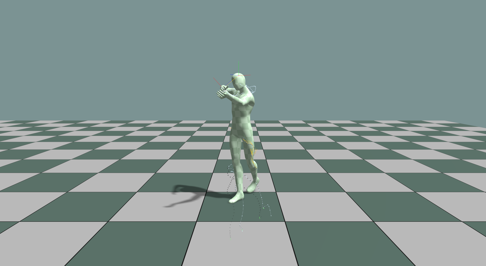
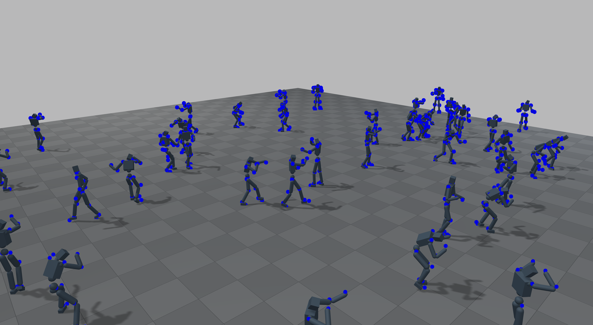
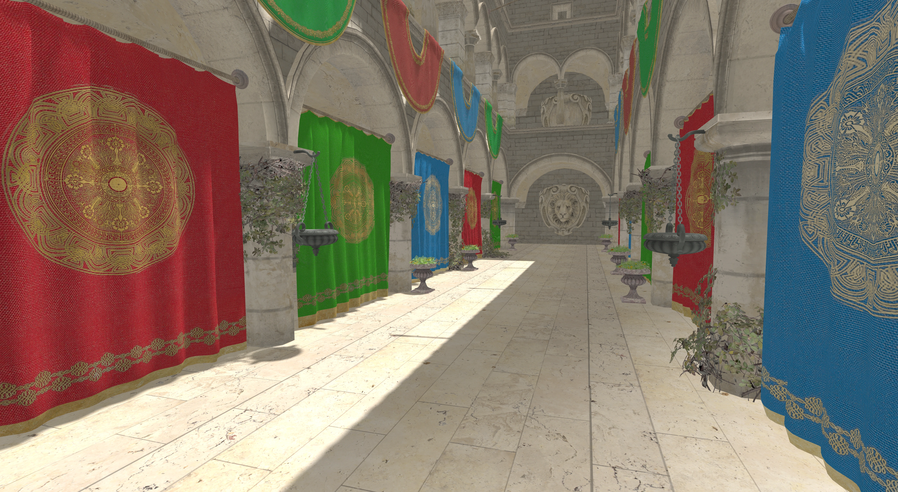

# KangEngine — Animation and Simulation Engine

KangEngine is an open-source C++17 and Python engine for real-time rendering, character animation, robotics, and PhysX-based simulation.
Start with the guide for runnable workflows, use
the API reference for exact Python signatures, and browse the examples for
complete programs.

| Character Animation | Simulation | Rendering |
|:---:|:---:|:---:|
|  |  |  |

```{toctree}
:maxdepth: 2
:caption: Documentation

guide/index
guide/integrations/INDEX
```

```{toctree}
:maxdepth: 2
:caption: API Reference

api/index
```

```{toctree}
:maxdepth: 2
:caption: Examples

examples/index
```
